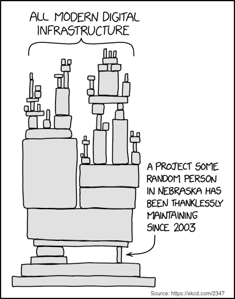

# Intro

\
The modern Internet relies on open-source projects developed and maintained by global developer communities. These projects have evolved from hobbyist practice to the foundation of innovation in just 80 years. However, developers behind these projects often receive no tangible rewards.

Enterprises build business models around open-source, generating revenue from developer work while relying on them to fix bugs. Open-source codebases provide core functionality but can also pose security risks, especially when developers lack financial incentives. For instance, Log4j, a widely used package, had a critical security vulnerability, causing panic and scrutiny towards unpaid volunteers who maintained it. This incident is not unique; other projects like core-js and Bitcoin core developers face similar challenges.

To unlock open-source's full potential, we need to incentivize developers to become stakeholders. This enables them to capture the value they create and facilitate capital inflows to the community without compromising core principles.

Open-source projects are frequently incentivized through sponsorship and bounty systems. However, these approaches have their shortcomings. Bounties, while allowing consumers to pay for specific features, may not align with a project's best interests. Sponsorship, on the other hand, tends to favor popular projects, leaving less-known components neglected. To address this bias, we have designed a sponsorship system that is more equitable.

<figure><figcaption></figcaption></figure>

\
